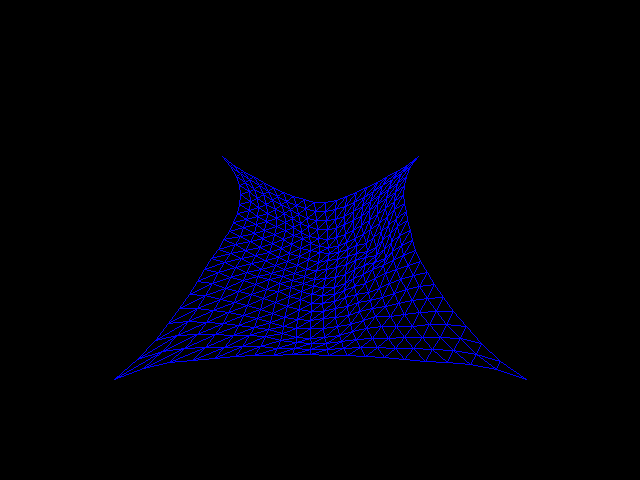

# FPE(eee)
Funky Physics Engine(eee) is a portable, fast, and flexible position-based physics engine.

## Try it
Try some demos of the project [here](https://duckdood.github.io/physics_demo) (cloth cutter demo recommended)

## Features
* Physics using second-order verlet integration
* 2D and 3D environments
* Distance and spring constraints
* Spatial partitioning for handling thousands of balls at once
* Dynamic walls made of particles (penetration constraints)
* Written fully in C for portability, interoperability, and speed.

## Building locally (Linux and MinGW)
* ### Dependencies
* A C compiler (I've tested with GCC and Clang)
* SDL3
* ### Building
`git clone https://github.com/duckdood/fpeeee && cd fpeeee && make`\
This will put demos in a the build/ directory for you to run.
